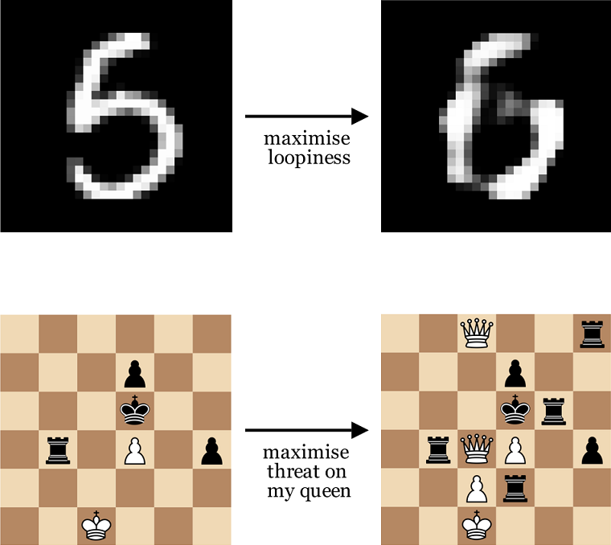

# Concept backpropagation

Corresponding paper: xx.xx.xx.xx

## Description
This project implements concept backpropagation, a method for visualising how a given concept (found through standard concept detection) is represented in a probed neural network model. Simply put, for a neural network model, an input sample, and a trained concept probe that indicates the presence of the given concept in one of the intermediary layers of the model, the method aims to find the smallest perturbation that maximises the detection of the concept. In practical cases, this means altering chess positions in order to maximise threats on certain pieces, or maximising the "loopiness" of standard MNIST digits.

This codebase includes routines for the application areas described in the corresponding paper. The chess models and chess-related concept datasets were retrieved from the repository for [Explainable Minichess](https://github.com/patrik-ha/explainable-minichess).